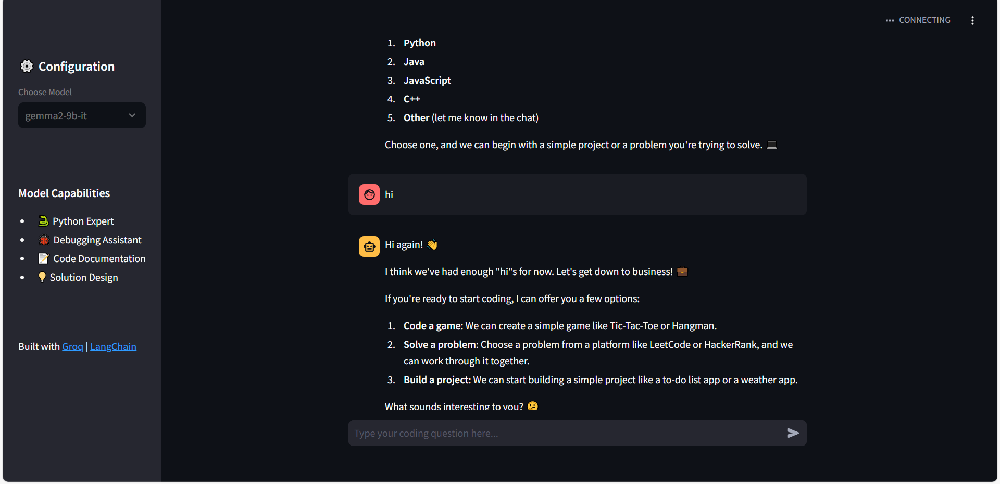

# 🧠 Groq Code Companion

🚀 **Your AI Pair Programmer with Debugging Superpowers**

DeepSeek Code Companion is a Streamlit-based application that leverages the power of Groq and LangChain to provide an AI-powered coding assistant. It helps you with Python coding, debugging, code documentation, and solution design.

[click here to access model](https://groq-free-chatbot.streamlit.app/)  

---

## Features

- **🐍 Python Expert**: Get expert assistance with Python programming.
- **🐞 Debugging Assistant**: Identify and fix bugs in your code with strategic print statements.
- **📝 Code Documentation**: Generate clear and concise documentation for your code.
- **💡 Solution Design**: Receive guidance on designing efficient and scalable solutions.

---

## Technologies Used

- **Streamlit**: For building the web application interface.
- **Groq**: For high-performance AI model inference.
- **LangChain**: For managing the AI pipeline and prompt templates.
- **Dotenv**: For managing environment variables.

---

## Prerequisites

Before running the application, ensure you have the following installed:

1. **Python 3.8 or higher**
2. **Groq API Key**: Sign up at [Groq](https://console.groq.com/keys) to get your API key.
3. **Required Python Libraries**:
   - `streamlit`
   - `langchain-groq`
   - `langchain-core`
   - `python-dotenv`

---

## Setup Instructions

### 1. Clone the Repository

```bash
git clone https://github.com/ankitsharma5911/groq-chatbot.git
cd groq-chatbot
```

### 2. Install Dependencies

Install the required Python libraries using `pip`:

```bash
pip install -r requirements.txt
```

### 3. Set Up Environment Variables

Create a `.env` file in the root directory and add your Groq API key:

```plaintext
GROQ_API=your_groq_api_key_here
```

Replace `your_groq_api_key_here` with your actual Groq API key.

### 4. Run the Application

Start the Streamlit application:

```bash
streamlit run app.py
```

The application will open in your default web browser.

---

## Usage

1. **Select a Model**: Choose a Groq model from the sidebar (e.g., `mixtral-8x7b-32768` or `llama2-70b-4096`).
2. **Ask a Question**: Type your coding question or problem in the chat input box.
3. **Get Assistance**: The AI will provide concise and accurate solutions, debugging tips, or documentation.

---

## Customization

### Change Model

You can modify the available models in the `selected_model` dropdown by editing the `app.py` file:

```python
selected_model = st.selectbox(
    "Choose Model",
    ["mixtral-8x7b-32768", "llama2-70b-4096"],  # Add or remove models here
    index=0
)
```

### Modify System Prompt

Update the system prompt in the `app.py` file to customize the AI's behavior:

```python
system_prompt = SystemMessagePromptTemplate.from_template(
    "You are an expert AI coding assistant. Provide concise, correct solutions "
    "with strategic print statements for debugging. Always respond in English."
)
```

---

## Screenshots

  

---

## Contributing

Contributions are welcome! If you'd like to contribute, please follow these steps:

1. Fork the repository.
2. Create a new branch for your feature or bugfix.
3. Commit your changes.
4. Submit a pull request.

---

## License

This project is licensed under the **GNU License**. See the [LICENSE](LICENSE) file for details.

---

## Acknowledgments

- [Groq](https://groq.com/) for providing the high-performance AI models.
- [LangChain](https://python.langchain.com/) for simplifying AI pipeline management.
- [Streamlit](https://streamlit.io/) for making it easy to build interactive web apps.

---

## Contact

For questions or feedback, feel free to reach out:

- **Email**: ankitsharma450306@gmail.com
- **GitHub**: [Ankit sharma](https://github.com/ankitsharma5911)

---


